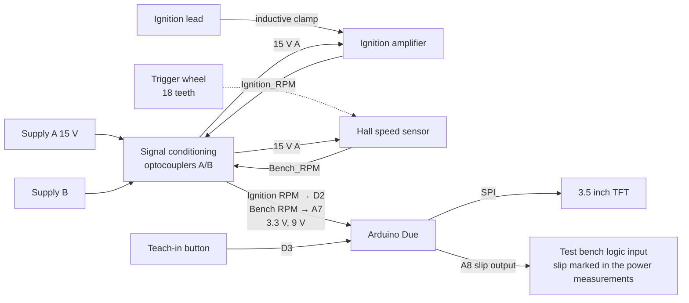

# Clutch Slip Monitor

[](https://doi.org/10.5281/zenodo.23002211) [](https://github.com/josto-me/clutch-slip-monitor/actions/workflows/build.yml) [](LICENSE) [](LICENSE-CC-BY-4.0.txt) [](CITATION.cff)

Clutch slip monitor for an engine test bench, based on an Arduino Due with a 3.5" TFT.

Kupplungsüberwachung für einen Motorprüfstand.

## Safety and disclaimer

This is a hobby project, not a certified product. Engine test benches have rotating parts,
high energies and ignition systems; work on them only with the protective measures of the
test bench. The slip output only marks slip in the measured data; it is not a safety function
and does not stop the engine. No warranty, see the licenses.

## What it does

The monitor compares the engine speed with the speed of the test bench behind the clutch:

- The **engine speed** comes from the ignition. An inductive clamp on the ignition lead picks up one pulse per revolution, and a small amplifier board turns it into a clean logic pulse.
- The **bench speed** comes from a Hall speed sensor on a trigger wheel with 18 teeth.

Both pulse trains go to the timer capture inputs of the SAM3X8E (TC0 and TC1, 42 MHz time base), which measure the period between two falling edges. The speed is `60 × 42 MHz / period`, divided by 18 for the trigger wheel, and smoothed with a moving average. Without pulses for about 1.2 s the speed is set to 0.

When the clutch is closed, press the teach-in button. The monitor then waits 5 s (yellow screen) and stores the ratio *engine speed / bench speed* (shown as "Ratio" on the screen). From then on it calculates the speed difference

`Ndiff = engine speed − bench speed × ratio`

If Ndiff stays above 100 rpm for more than 100 ms, the monitor treats it as clutch slip and pulls the slip output low for at least 1 s.

The slip output (A8) drives a logic input of the test bench. The bench records it together with its power measurements, so every slip event is marked in the measured data and a run with a slipping clutch can be told apart from a real loss of power.

The main screen shows the taught ratio and two bar graphs: engine speed (0–16 000 rpm) and Ndiff (0–100 rpm). A third timer channel (TC2) gives a 500 µs tick for all software timers.

## Hardware

| | |
|---|---|
| Controller | Arduino Due (SAM3X8E, 84 MHz) |
| Display | Adafruit 3.5" TFT 480×320, HX8357D, hardware SPI (the touch panel is not used) |
| Engine speed | inductive clamp on the ignition lead, then the ignition amplifier board |
| Bench speed | Hall speed sensor (GS100101 type) on a trigger wheel with 18 teeth (20° pitch) |
| Signal conditioning | own board with optocouplers between the sensor side and the Due side, 3.3 V logic outputs, 9 V supply for the Due |
| Operation | one push button to teach in the ratio, one slip output to a logic input of the test bench |

### Pin assignment (Arduino Due)

| Signal | Due pin | SAM3X8E | Define | Function |
|---|---|---|---|---|
| Engine RPM | D2 | PB25 | `BIT_ERPM` | TIOA0, capture on falling edge |
| Bench RPM | A7 | PA2 | `BIT_BRPM` | TIOA1, capture on falling edge |
| Teach-in button | D3 | PC28 | `BIT_BUTTON` | input with pull-up, low = pressed |
| Slip output | A8 | PB17 | `BIT_SLIP` | output, low = slip; goes to a logic input of the test bench (3.3 V level) |
| TFT CS / DC / RST | D10 / D11 / D12 | | `TFT_CS` / `TFT_DC` / `TFT_RST` | |
| TFT MOSI / MISO / SCK | SPI header | | | hardware SPI |

### Boards

All boards are drawn in EAGLE. For each board there is a schematic and a layout PDF (copper, pads and component outlines).

- **Signal conditioning** (`hardware/signal-conditioning/`, "Signalaufbereitung"). This board has two galvanically separated sides. Side A runs from a typical automotive supply (nominally 12–15 V) and feeds the Hall sensor and the ignition amplifier; it carries the inputs Bench_RPM and Ignition_RPM. Side B is the Due side. PC900 optocouplers carry both signals across, and the outputs switch to 3.3 V (LD1117V33). An LM7809 supplies the Due with 9 V from side B.
- **Ignition amplifier** (`hardware/ignition-amplifier/`, "Zündsignalverstärker"). Takes the signal from the inductive clamp, limits it with a Schottky diode and a 12 V Zener diode, and forms a fixed-length pulse per ignition with an HCF4098 dual monostable. It runs from 12 V (78L12).
- **CDI_RPM** (`hardware/cdi-rpm/`, "Prüfstandplatine"). A variant of the ignition amplifier made as a separate test-bench board. See below.

### Ignition amplifier and CDI_RPM

Both boards do the same job: they turn the raw ignition signal into a clean speed pulse. CDI_RPM reuses the ignition amplifier's function as a board of its own. The circuits differ as follows.

| | Ignition amplifier | CDI_RPM |
|---|---|---|
| Input | directly from the clamp, clamped by a Schottky and a 12 V Zener diode | CNY17-3 optocoupler with 2 × 10 kΩ series resistors and a 1N4007 reverse diode, so the input is isolated |
| Pulse forming | HCF4098 monostable, fixed pulse length | HCF40106 Schmitt trigger with an RC filter (50 kΩ, 10 nF, diode), which suppresses ringing |
| Output | logic pulse to the signal conditioning board, where the isolation is done | BC547 driving a second CNY17-3, open-collector output with a 10 kΩ pull-up, so the output is isolated |
| Supply | 78L12, 12 V | LM7815, 15 V, with a red power LED |

In short, CDI_RPM has isolation on the board itself (optocoupler in and out) and uses a Schmitt trigger instead of the monostable. That lets it run without the signal conditioning board. A bill of materials for CDI_RPM is in `hardware/bom/cdi-rpm-bom.csv`.

## Block diagram



## Contents

```
firmware/Clutch_Slip_Monitor/     Arduino Due sketch (main program and TFT main screen)
hardware/signal-conditioning/     signal conditioning board: schematic and board PDF
hardware/ignition-amplifier/      ignition amplifier: schematic and board PDF
hardware/cdi-rpm/                 CDI_RPM variant: schematic and board PDF
hardware/bom/                     bill of materials CDI_RPM
```

## Build

1. Arduino IDE with the board package **Arduino SAM Boards (32-bits ARM Cortex-M3)**. Select the board **Arduino Due (Programming Port)**.
2. Install these libraries with the Library Manager:
   - **Adafruit GFX Library**
   - **Adafruit HX8357 Library**, plus **Adafruit BusIO**, which newer versions need
3. Open `firmware/Clutch_Slip_Monitor/Clutch_Slip_Monitor.ino` and upload it.

Notes:

- The sketch has its own `int main()` with `SystemInit(); init();` and register-level setup of the PIO and TC units. `setup()` and `loop()` are not used.
- The watchdog is disabled at the start of `main()`, because current SAM cores only disable it in their own `main()`.
- Write-only registers (`PIO_PER/PDR/OER/ODR/SODR/CODR/PUER/PUDR/IFER`, `TC_CCR`, `TC_IER`, `PMC_PCER0`) are written with `=`, not `|=`.
- The speed filter state is a `float`; the speed difference is a signed `int32_t`, and the bar graph shows negative values as 0. A captured period of 0 is ignored, and the ratio is only taught in when both speeds are above 0.
- The display type HX8357D is set in the constructor of the current *Adafruit HX8357 Library*; `begin()` takes no type argument. The touch panel is not used.
- There is no serial output.
- The firmware has not been tested on hardware.

## License

- Code in `firmware/`: **Apache License 2.0**, see [`LICENSE`](LICENSE) and [`NOTICE`](NOTICE).
- `hardware/` and the README: **CC BY 4.0**, see [`LICENSE-CC-BY-4.0.txt`](LICENSE-CC-BY-4.0.txt).

You may use, change and share everything, also commercially. When you pass it on or
publish something based on it, credit it as:

> Johannes Stockhammer, "Clutch Slip Monitor", version 1.0.0, Zenodo, https://doi.org/10.5281/zenodo.23002212

GitHub shows the same citation under "Cite this repository" (from [`CITATION.cff`](CITATION.cff)).

## Dependencies

Required to build: Arduino SAM core with SPI (LGPL-2.1-or-later; SPI GPL-2.0 or LGPL-2.1), Adafruit GFX Library (BSD), Adafruit HX8357 Library (MIT), Adafruit BusIO (MIT). Install them with the Arduino IDE.

## Trademarks

Arduino, Adafruit, Atmel and EAGLE are trademarks of their respective owners, used only to identify the hardware and tools, with no affiliation or endorsement.

## Author

Johannes Stockhammer

Concept, hardware and original firmware by Johannes Stockhammer. Translation, code and documentation were revised with the help of AI tools and reviewed by the author.
